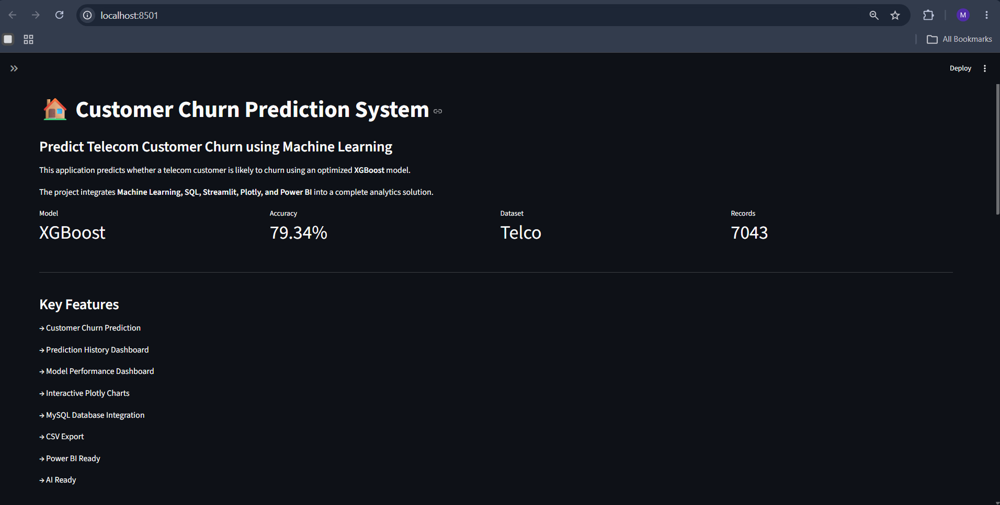
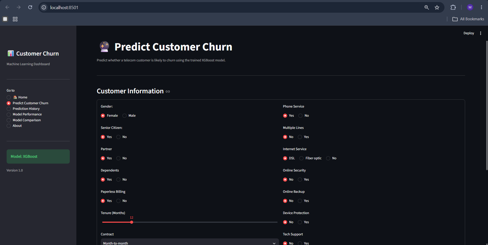
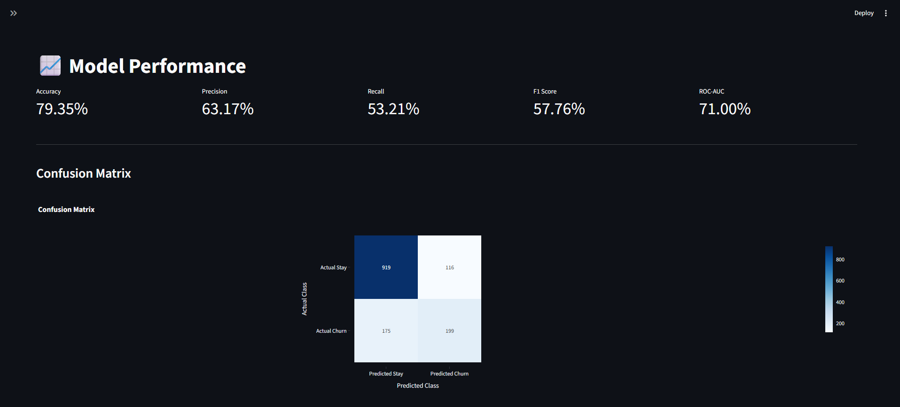
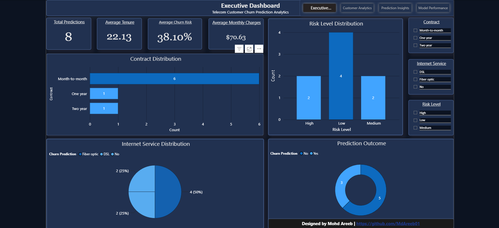
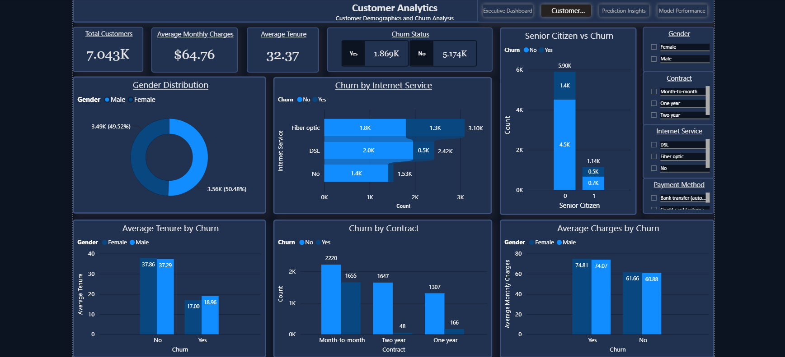
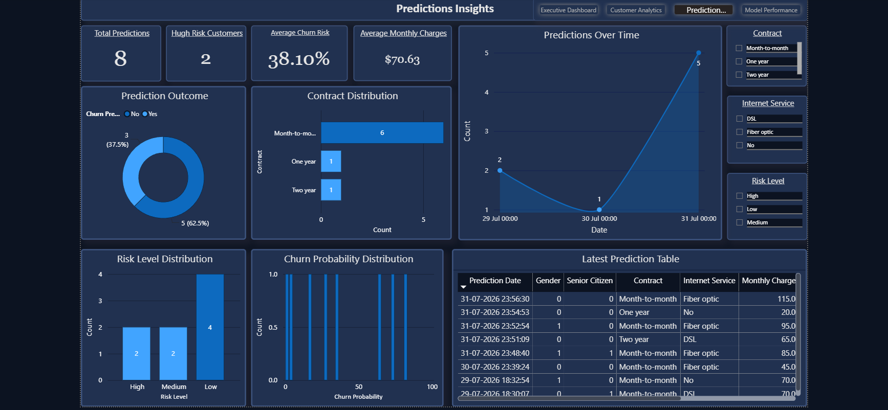
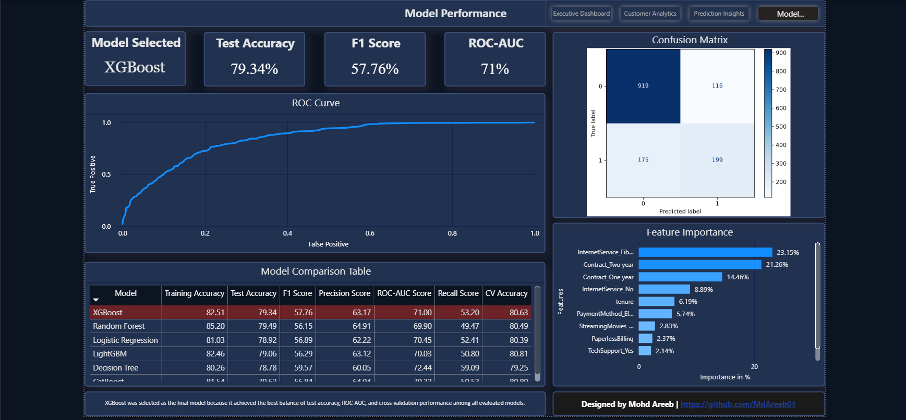

# Customer Churn Prediction System

An end-to-end machine learning and business intelligence project for predicting telecom customer churn using XGBoost, Streamlit, MySQL, and Power BI.

---

## Project Overview

Customer churn is a major challenge for telecom companies because retaining existing customers is often more valuable than acquiring new ones.

This project develops an end-to-end Customer Churn Prediction System that:

- Cleans and preprocesses telecom customer data
- Performs exploratory data analysis
- Engineers features for machine learning
- Compares multiple classification models
- Selects XGBoost as the final model
- Provides an interactive Streamlit prediction application
- Stores prediction results in MySQL
- Visualizes customer and prediction insights using Power BI
- Provides model evaluation and performance analysis

---

## Project Architecture

```text
Raw Telecom Dataset
        ↓
Data Cleaning & EDA
        ↓
Feature Engineering
        ↓
Multiple ML Models
        ↓
Model Comparison
        ↓
XGBoost Selected
        ↓
Saved ML Model
        ↓
Streamlit Application
        ↓
Customer Churn Prediction
        ↓
MySQL Database
        ↓
Power BI Dashboards
```

---

## Machine Learning

The following classification models were evaluated:

- Logistic Regression
- Decision Tree
- Random Forest
- XGBoost
- LightGBM
- CatBoost

XGBoost was selected as the final model based on the overall balance of test accuracy, F1 score, ROC-AUC, and cross-validation performance.

### XGBoost Performance

| Metric                    |  Score |
| ------------------------- | -----: |
| Test Accuracy             | 79.34% |
| F1 Score                  | 57.76% |
| Precision                 | 63.17% |
| Recall                    | 53.20% |
| ROC-AUC                   | 71.00% |
| Cross-Validation Accuracy | 80.63% |

---

## -Streamlit Application

The Streamlit application allows users to:

- Enter customer information
- Generate a churn prediction
- View churn probability
- View customer risk level
- Estimate total charges
- Save predictions to MySQL
- View prediction history
- Analyze prediction results using interactive Plotly visualizations

### Streamlit Screenshots

#### Home



#### Customer Prediction



#### Model Performance



---

## MySQL Database

Prediction results generated through the Streamlit application are stored in a MySQL database.

The database stores information such as:

- Customer characteristics
- Tenure
- Phone Service
- Internet service
- Contract type
- Monthly charges
- Total charges
- Churn prediction
- Churn probability
- Risk level
- Prediction date

This allows prediction results to be persisted and analyzed later.

---

## Power BI Dashboard

The Power BI report contains four interactive pages.

### 1. Executive Dashboard

Provides a high-level overview of prediction activity and customer risk.



### 2. Customer Analytics

Analyzes customer demographics, services, contracts, charges, tenure, and churn patterns.



### 3. Prediction Insights

Analyzes predictions generated by the Streamlit application and stored in MySQL.



### 4. Model Performance

Displays:

- Model evaluation metrics
- ROC curve
- Confusion matrix
- Feature importance
- Model comparison



---

## Technologies Used

### Programming & Machine Learning

- Python
- Pandas
- NumPy
- Scikit-learn
- XGBoost
- LightGBM
- CatBoost
- Joblib

### Application Development

- Streamlit
- Plotly

### Database

- MySQL
- MySQL Connector/Python

### Business Intelligence

- Microsoft Power BI

### Development Tools

- Jupyter Notebook
- Visual Studio Code
- Git
- GitHub

---

## Priject Structure

Customer-Churn-Prediction-System/ 
│
├── app/
│   ├── about.py
│   ├── app.py
│   ├── database.py
│   ├── hero_section.py
│   ├── model_comparison.py
│   ├── model_performance.py
│   ├── prediction.py
│   └── utils.py
│
├── artifacts/
|   ├── X_test.pkl
|   ├── confusion_matrix.pkl
│   ├── confusion_matrix.png
│   ├── feature_importance.csv
│   ├── feature_importance.pkl
│   ├── fpr_tpr.csv
│   ├── model_comparison.csv
|   ├── model_metrics.pkl
|   ├── roc_curve.pkl
|   └── y_test.pkl
│
├── data/
│   ├── raw/
|   |   └── Telco_Customer_Churn.csv
│   └── processed/
|       └── Telco_Customer_Churn-Clean.csv
│
├── models/
│   ├── feature_columns.pkl
│   ├── scaler.pkl
│   └── xgboost_model.pkl
│
├── notebooks/
│   ├── 01_Data_Understanding_&_Cleaning.ipynb
│   ├── 02_MySQL_Connection.ipynb
│   └── 03_Feature_Engineering.ipynb
│
├── powerbi/
│   └── customer_churn_dashboard.pbix
│
├── screenshots/
│   ├── Customer_Analytics.png
│   ├── Executive_Dashboard.png
│   ├── Model_Performance.png
│   ├── Prediction_Insights.png
|   ├── Prediction_Page.png
|   ├── Streamlit_Home.png
|   └── Streamlit_Model_Performance.png
│
├── .gitignore
├── README.md
└── requirements.txt

---

## Installation

### 1. Clone the repository

- git clone https://github.com/MdAreeb01/Customer-Churn-Prediction-System.git

- cd Customer-Churn-Prediction-System

### 2. Create a virtual environment

- python -m venv venv

Activate it on Windows:

- venv\Scripts\activate

### 3. Install dependencies

- pip install -r requirements.txt

### 4. Configure MySQL

Create a MySQL database named:
- customer_churn_db

Configure your local database using a .env file.

Example:
```text
MYSQL_HOST=127.0.0.1
MYSQL_PORT=3306
MYSQL_USER=root
MYSQL_PASSWORD=your_password
MYSQL_DATABASE=customer_churn_db
```
Do not commit the .env file to GitHub.

### 5. Run the Streamlit application

- streamlit run app/app.py

---

## Key Features

- End-to-end machine learning workflow
- Multi-model comparison
- XGBoost-based churn prediction
- Churn probability and risk classification
- Interactive Streamlit interface
- MySQL prediction storage
- Prediction history
- Interactive Plotly visualizations
- Four-page Power BI dashboard
- Model evaluation dashboard
- Feature importance analysis
- ROC curve and confusion matrix

---

## Future Improvements

Planned improvements include:

- AI-powered prediction explanations
- AI-generated customer retention recommendations
- Natural-language analysis of prediction history
- Streamlit deployment
- Improved customer risk segmentation
- Automated model retraining

---

## Author

Mohd Areeb

Data Science | Machine Learning | Business Intelligence